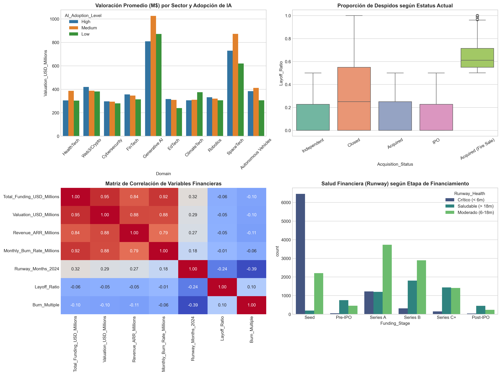
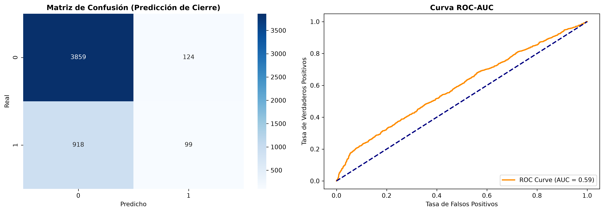

# 🚀 Global Tech Startups Analysis & Risk Prediction (2026)

Un proyecto end-to-end de **Análisis Exploratorio de Datos (EDA)**, **Ingeniería de Características Vectorizadas**, **Procesamiento de Lenguaje Natural (NLP)** y **Pipelines de Machine Learning** para analizar y predecir el riesgo de cierre en 25,000 tech startups a nivel global.

---

## 📌 Tabla de Contenidos
1. [Descripción del Problema](#-descripción-del-problema)
2. [Estructura del Repositorio](#-estructura-del-repositorio)
3. [Análisis Exploratorio y NumPy (EDA)](#-análisis-exploratorio-y-numpy-eda)
4. [Machine Learning & Pipelines](#-machine-learning--pipelines)
5. [Resultados Clave y Hallazgos](#-resultados-clave-y-hallazgos-del-análisis)
6. [Instalación y Uso](#-instalación-y-uso)
7. [Autor](#-autor)

---

## 🎯 Descripción del Problema

El ecosistema global de startups tecnológicas enfrenta importantes desafíos financieros, altos niveles de tasa de quemado de capital (*burn rate*) y reestructuraciones de personal (*layoffs*). 

Este proyecto utiliza un dataset de **25,000 startups** para:
* Evaluar la salud financiera mediante **cálculos matriciales/vectoriales con NumPy**.
* Imputar y limpiar valores faltantes en niveles de adopción de Inteligencia Artificial mediante métodos no paramétricos.
* Extraer embeddings textuales mediante **TF-IDF Vectorizer** combinando atributos de dominio, ubicación e inversores.
* Construir un **Pipeline robusto de Scikit-Learn** para clasificar el riesgo de cierre (*Closed*) de una startup.
* Agrupar a las empresas en arquetipos de riesgo mediante **K-Means Clustering**.

---

## 📊 Análisis Exploratorio y NumPy (EDA)

Durante el análisis exploratorio de datos, se realizaron las siguientes transformaciones clave:

* **Tratamiento de Nulos:** Imputación no paramétrica por moda condicionada según la industria (`Domain`) para la variable `AI_Adoption_Level`.
* **Feature Engineering con NumPy:** 
  * `Valuation_Multiple`: Ratio entre valoración y revenue vectorizado ($\text{Valuation} / \text{Revenue}$).
  * `Burn_Multiple`: Métrica de eficiencia de capital ($\text{Burn Rate} \times 12 / \text{Revenue}$).
  * `Runway_Health`: Clasificación vectorizada con `np.select()` en categorías: *Crítico (< 6m)*, *Moderado (6-18m)* y *Saludable (> 18m)*.

---

## 🤖 Machine Learning & Pipelines

Se construyó un **Pipeline de Clasificación** integral usando `scikit-learn` que combina:

1. **Preprocesamiento:**
   * `StandardScaler` e `Imputer` para variables cuantitativas.
   * `OneHotEncoder` para variables categóricas (`Domain`, `Investor_Tier`, `AI_Adoption_Level`).
   * `TfidfVectorizer` para la columna de síntesis textual (`Text_Profile`).
2. **Modelo Predictivo:** `RandomForestClassifier` optimizado para predecir la variable objetivo `Is_Closed`.
3. **Clustering (K-Means):** Segmentación no supervisada en 3 arquetipos de salud financiera.

---

## 💡 Resultados Clave y Hallazgos del Análisis

A partir del análisis exploratorio y del modelado predictivo sobre las **25,000 startups**, se obtuvieron las siguientes conclusiones cuantitativas vinculadas a la problemática inicial:

### 1. Salud Financiera y Riesgo de Liquidez (NumPy Metrics)
* **32.9% de las startups** presentan una salud financiera en **estado crítico** con un *Runway* inferior a 6 meses.
* **43.7%** se mantienen en un rango moderado (6 a 18 meses).
* **23.4%** exhiben una posición saludable superior a 18 meses de caja.
* Las empresas que terminan en cierre mantuvieron un **Burn Multiple promedio de 3.10x** (frente a 2.80x en las operativas).

### 2. Imputación y Calidad de Datos
* Se imputaron exitosamente **2,592 registros faltantes** (~10.4% de los datos) en la variable `AI_Adoption_Level` utilizando la moda condicionada por dominio tecnológico.

### 3. Vulnerabilidad por Sector Tecnológico
* La tasa global de cierre (*Closed*) del dataset se ubica en **20.35%**.
* **Web3 / Crypto** es el sector de mayor vulnerabilidad, registrando una **tasa de cierre del 48.1%**.
* **Generative AI** (17.0%) y **Autonomous Vehicles** (17.4%) mostraron la mayor tasa de supervivencia.

### 4. Rendimiento del Modelo Predictivo
* **Accuracy Global:** **79.0%** en la clasificación del estado de la startup.
* **ROC-AUC Score:** **0.59** evaluando la capacidad de discriminación en situaciones de desbalance de clases.

### 5. Segmentación de Mercado (Arquetipos K-Means)
* **Cluster 0 - Startups Maduras en Escala (34.8% / 8,710 empresas):** Valoración promedio de **$818.6M**, ARR medio de **$58.2M**, Runway sólido de **22.6 meses** y baja tasa de quiebra (**16.4%**).
* **Cluster 1 - Etapa Temprana de Alto Riesgo (64.2% / 16,045 empresas):** Valoración promedio de **$76.9M**, ARR de **$5.2M**, Runway crítico de **6.3 meses** y la mayor tasa de mortalidad (**22.5%**).
* **Cluster 2 - Unicornios / Outliers de Escala (1.0% / 245 empresas):** Gigantes tecnológicos con valoración promedio de **$13.2B** y ARR de **$986.3M**.
## 📁 Estructura del Repositorio

´´´text
Global-Tech-Startups-Analysis/
├── Data/
│   ├── raw/                      # Dataset original (25,000 startups)
│   └── processed/                # Dataset limpio y transformado (CSV)
├── Images/                       # Gráficos exportados para reporte
│   ├── eda_summary_dashboard.png
│   └── model_evaluation_metrics.png
├── models/                       # Pipeline entrenado exportado (.pkl)
│   └── startup_risk_pipeline.pkl
├── Notebooks/
│   ├── 01_Analisis_Exploratorio.ipynb
│   └── 02_Machine_Learning_Pipelines.ipynb
├── src/                          # Código fuente y App interactiva
│   └── app.py
├── .gitignore
├── README.md
└── requirements.txt
